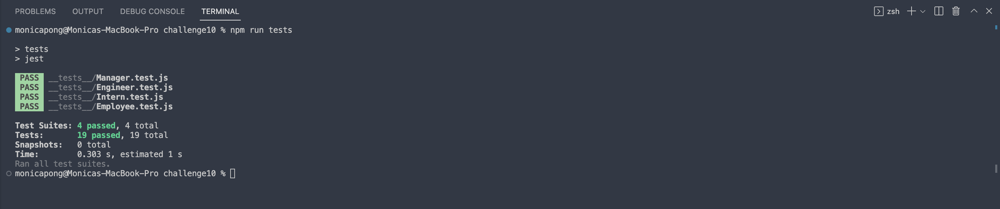

# Module 10 Object-Oriented Programming: Team Profile Generator


## Description

This application allows the user to enter team member information when prompted in order to create a webpage that displayes a team profile allowing for easy access to the team member's information such as ID, email, office number, GitHub username, and school. This application runs in CLI and implements Node.js, Inquirer, and Jest.

- [GitHub repository](https://github.com/monicapong/teamProfileGenerator)

## Table of Contents

- [Installation](#installation)
- [Usage](#usage)
- [Credits](#credits)
- [License](#license)
- [Tests](#tests)
- [Questions](#questions)

## Installation

- Inquirer

```
npm i inquirer@8.2.4
```

- Jest

```
npm i jest
```

## Usage

1. Start the application in CLI

```
node index.js
```

2. Enter the manager's information by answering each prompt.
3. To add an engineer or intern, choose the respective choice at the menu and answer each prompt.
4. When you're finish adding all team members, choose 'Finish building my team'
5. A confirmation that an HTML file was created succesfully will appear in the console log.
6. View the Team Profile HTML under the dist folder


## Credits

- [Tailwind CSS Framework](https://tailwindcomponents.com/component/list-order-product)

## License

This application is distributed under the MIT License. Please review the [MIT License](https://choosealicense.com/licenses/mit) for more information.

## Tests

```
npm run tests
```


## Questions

If there are any questions about this application, please feel free to visit my [GitHub profile](http://github.com/monicapong)
